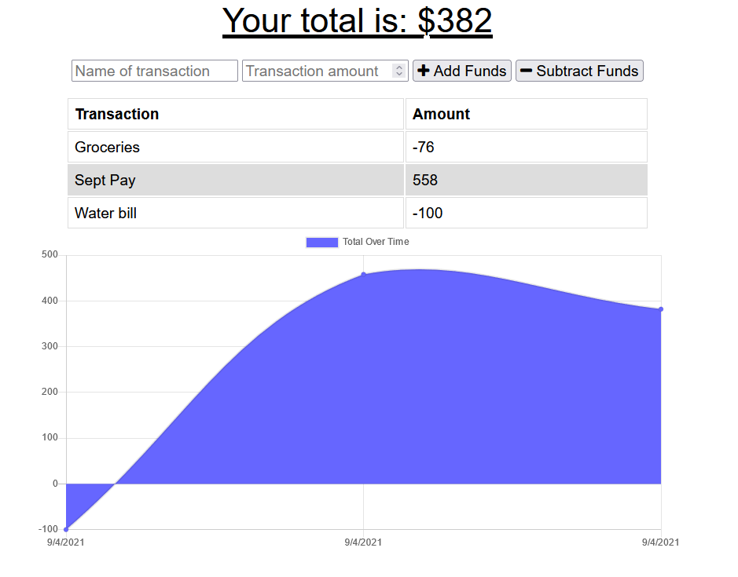
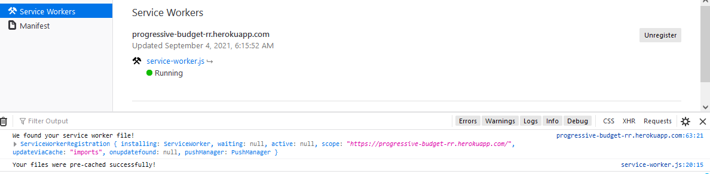
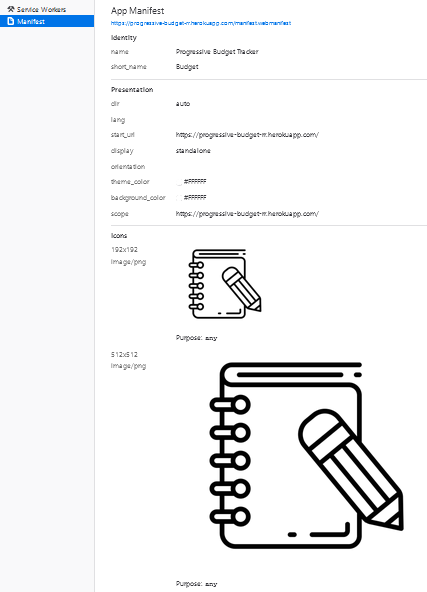
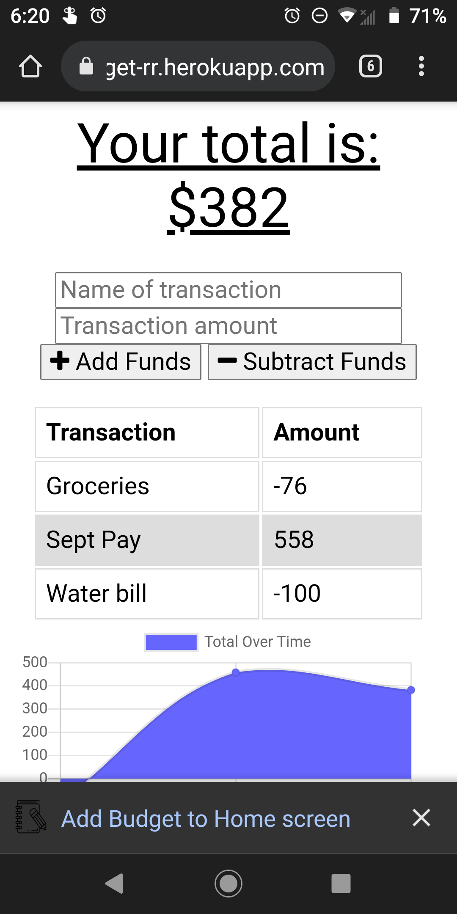
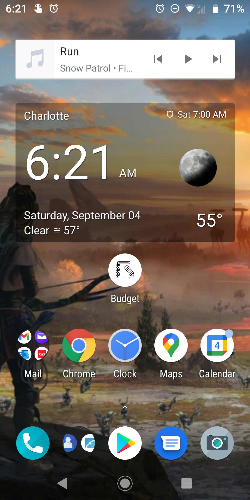
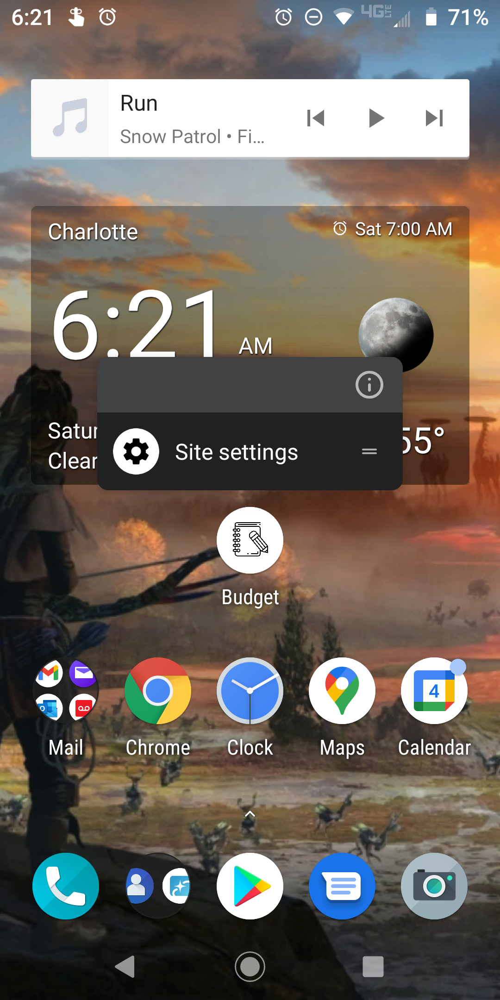
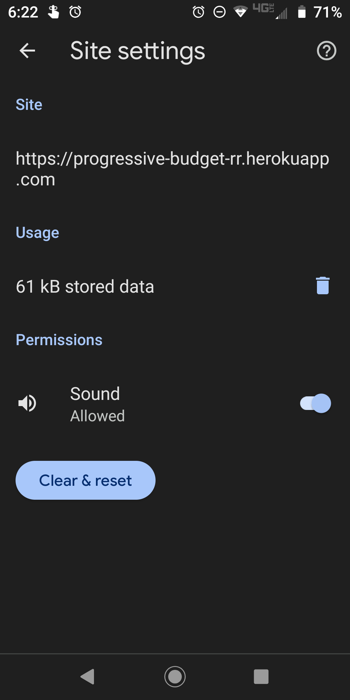

# #18 Offline_Budget-Tracker

## [App Deployed on Heroku](https://progressive-budget-rr.herokuapp.com)

## Description:

# Installation:

    Open heroku link on mobile device and click "Add Budget to Home screen" to have offline budget tracking app.

# Usage:

## Service Worker

## Manifest Detail

## Downloadable:

## Home Screen

  

# Questions: https://github.com/Crowderyan

### Email me: <a href="mailto:Rebuiltrival@gmail.com" hspace="20">Rebuiltrival@gmail.com</a>
